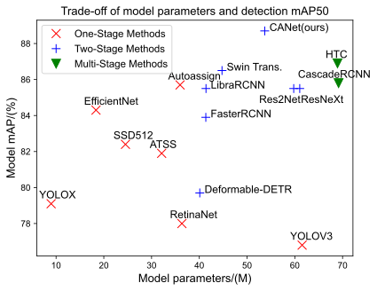

## CANet

This is the official implementation of the paper [CANet: Contextual information and spatial attention based network for detecting small defects in manufacturing industry](https://www.sciencedirect.com/science/article/abs/pii/S0031320323002583) accepeted to journal [Pattern Recognition](https://www.sciencedirect.com/journal/pattern-recognition). Author: [Xiuquan Hou](https://github.com/xiuqhou), [Meiqin Liu](https://scholar.google.com/citations?user=T07OWMkAAAAJ&hl=zh-CN&oi=ao), Senlin Zhang, [Ping Wei](https://scholar.google.com/citations?user=1OQBtdcAAAAJ&hl=zh-CN&oi=ao), [Badong Chen](https://scholar.google.com/citations?user=mq6tPX4AAAAJ&hl=zh-CN&oi=ao).

**💖 If our CANet is helpful to your researches or projects, please help star this repository. Thanks! 🤗**

<div align="center">
  
</div>

---

## 🔧Implementations

We provide two implementations based on [MMDetection](https://github.com/open-mmlab/mmdetection) and [PyTorch](https://pytorch.org/). For better scalability and simpler environment configuration, I will mainly maintain the implementation based on pure PyTorch, which is more recommended to use.

- [CANet based on MMDetection](CANet-MMDetection/README.md)
- [CANet based on pure PyTorch](CANet-pytorch/README.md)

## Update

- [2024.7.5] Add the implementation of CANet based on pure PyTorch.
- [2023.3.27] [Paper](https://www.sciencedirect.com/science/article/abs/pii/S0031320323002583) is accepted to [Pattern Recognition](https://www.sciencedirect.com/journal/pattern-recognition), code is available.

## BibTeX

If you find our work helpful for your research, please consider citing the following BibTeX entry or give us a star ⭐.

```bibtex
@article{HOU2023109558,
    title = {CANet: Contextual Information and Spatial Attention Based Network for Detecting Small Defects in Manufacturing Industry},
    journal = {Pattern Recognition},
    volume = {140},
    pages = {109558},
    year = {2023},
    issn = {0031-3203},
    doi = {https://doi.org/10.1016/j.patcog.2023.109558},
    url = {https://www.sciencedirect.com/science/article/pii/S0031320323002583},
    author = {Xiuquan Hou and Meiqin Liu and Senlin Zhang and Ping Wei and Badong Chen},
}
```